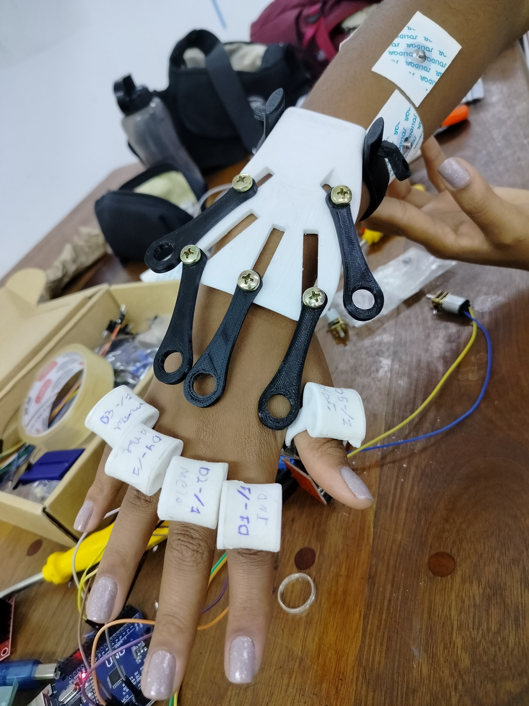
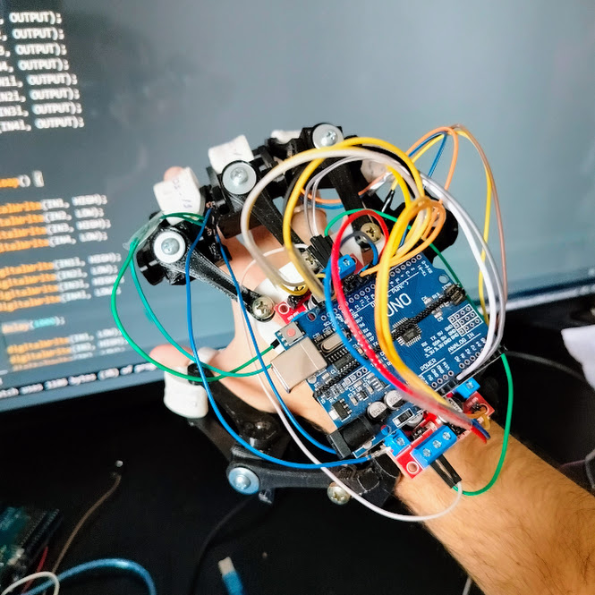

<h1 style="text-align: center;">H.E.R</h1>

O projeto **H.E.R** *(Hand Exoskeleton for Rehabilitation)* representa uma solução inovadora no campo da reabilitação motora, inicialmente concebida por uma equipe de estudantes do ensino médio de uma equipe de robótica. A iniciativa foi impulsionada por pesquisas de campo que identificaram a carência de soluções criativas para problemas inteligentes enfrentados por alunos da rede estadual, particularmente em relação à falta de tratamento médico e acompanhamento personalizado de fisioterapeutas.

O design ergonômico do *H.E.R*, desenvolvido a partir de estudos sobre a anatomia humana e engenharia robótica iniciados no final de 2022, visa reabilitar a coordenação motora fina das mãos. O protótipo foi apresentado oficialmente na *MTR23* (Mostra de Tecnologia e Robótica de 2023), após testes rigorosos para funcionalidade e aplicabilidade. O evento destacou a necessidade de atualizações, incluindo a utilização de softwares avançados e o aprimoramento ergonômico.

O *H.E.R* é projetado para proporcionar independência aos usuários, combatendo problemas como a atrofia muscular resultante da falta de movimentação dos dedos das mãos. Sua aplicação clínica abrange reabilitação pós-AVC, lesões neuromusculares nas mãos, dispraxia e outras condições neuromotoras. A captura de sinais musculares por sensores eletromiográficos torna o sistema autônomo e fácil de usar, promovendo uma abordagem personalizada e eficaz na recuperação.

O *H.E.R* não é apenas uma prótese exoesquelética; é uma solução integrada que visa redefinir a experiência da reabilitação motora, promovendo inclusão, dignidade e uma melhoria efetiva na qualidade de vida dos pacientes. Sua versatilidade, aliada à sua abordagem centrada no usuário, posiciona o *H.E.R* como um avanço significativo no panorama da reabilitação motora.

<h2 style="text-align: center;">Introdução</h2>

A genesis do nosso projeto remonta a uma iniciativa singular, impulsionada por jovens estudantes do ensino médio integrantes de uma equipe de robótica. Ao conduzirem pesquisas de campo, perceberam a lacuna existente nas soluções disponíveis para os desafios enfrentados por indivíduos com comprometimento da coordenação motora fina. Inspirados por essa necessidade urgente e pela vontade de criar impacto positivo, nossa equipe embarcou em uma jornada de inovação que culminou na concepção da prótese exoesquelética.

No final de 2022, após pesquisas aprofundadas envolvendo anatomia humana e engenharia robótica, visando compreender as complexidades físicas e as demandas tecnológicas, iniciamos os estudos fundamentais para o desenvolvimento do projeto. Foi nesse cenário que reconhecemos a necessidade premente de uma solução criativa para problemas inteligentes, uma solução que fosse não apenas tecnicamente avançada, mas também centrada nas necessidades reais dos usuários.

Os estudos evoluíram organicamente ao longo do tempo, e, após meticulosos processos de pesquisa e prototipagem, apresentamos o fruto desse esforço: o *H.E.R (Hand Exoskeleton for Rehabilitation)*, nosso primeiro protótipo. Esse marco foi atingido no final do ano de 2023, representando não apenas uma realização técnica, mas também um compromisso tangível com a missão de melhorar a qualidade de vida de alunos portadores de deficiências e de todos que enfrentam desafios semelhantes.

Este relatório detalhará não apenas os aspectos técnicos do *H.E.R*, mas também a jornada de pesquisa, desenvolvimento e aplicação clínica que moldou essa inovação. Acreditamos que o H.E.R não é apenas uma prótese exoesquelética, mas uma expressão concreta do poder transformador que pode surgir quando a paixão pela tecnologia se une ao compromisso com a humanidade.

<h2 style="text-align: center;">Contextualização</h2>

O protótipo inicial do H.E.R teve sua estreia oficial na *MTR23 (Mostra de Tecnologia e Robótica de 2023)*, um evento marcante sediado pela Secretaria de Educação de Caieiras, na FATEC da cidade de Franco da Rocha. Esse momento representou não apenas a apresentação pública da nossa inovação, mas também um passo crucial na validação da funcionalidade e aplicabilidade do protótipo.

Antes de sua apresentação oficial, o *H.E.R* passou por uma série de testes rigorosos, nos quais avaliamos cuidadosamente sua eficácia em ambientes reais de reabilitação. Esses testes não apenas confirmaram a promissora funcionalidade do dispositivo, mas também ofereceram insights valiosos para futuras melhorias. A interação direta com usuários potenciais, aliada aos feedbacks de profissionais de saúde, foi fundamental para refinar a ergonomia da prótese e garantir uma experiência de reabilitação autônoma verdadeiramente eficaz.

Durante a MTR23, destacamos não apenas os aspectos técnicos do *H.E.R*, mas também os resultados tangíveis desses testes e interações. Além disso, compartilhamos nossa visão para o futuro, delineando planos para atualizações futuras que incluem a integração de softwares avançados e o aperfeiçoamento contínuo da ergonomia do dispositivo.

Essa etapa representou não apenas um marco em nossa jornada, mas também um compromisso com a transparência, aprendizado contínuo e a busca incessante por aprimoramentos que elevem a eficácia e a acessibilidade da prótese exoesquelética *H.E.R.* Estamos confiantes de que as experiências compartilhadas na *MTR23* impulsionarão não apenas o desenvolvimento do *H.E.R*, mas também inspirarão inovações futuras no campo da reabilitação motora.

<h2 style="text-align: center;">Desenvolvimento</h2>

O H.E.R foi concebido com a missão primordial de conferir maior independência aos seus usuários, enfrentando desafios diretamente relacionados à autoestima e à carência de alunos da rede estadual. Esses desafios emergem da falta de acesso a tratamentos médicos adequados e, por vezes, da impossibilidade de receber um acompanhamento personalizado de um fisioterapeuta. Nessa perspectiva, o projeto H.E.R surge como uma solução criativa e inovadora, oferecendo uma abordagem que vai além das limitações tradicionais.

O design ergonômico do *H.E.R* foi inicialmente concebido com foco na reabilitação da coordenação motora fina das mãos. Este aspecto do projeto não apenas busca enfrentar as dificuldades motoras específicas enfrentadas pelos usuários, mas também atua como uma ferramenta eficaz na prevenção da atrofia muscular resultante da falta de movimentação dos dedos das mãos. Ao proporcionar uma solução que promove a movimentação controlada e específica, o *H.E.R* visa combater o declínio da saúde muscular, melhorando a qualidade de vida dos usuários.

Além disso, a abordagem centrada no usuário é essencial para combater não apenas as limitações físicas, mas também as implicações psicológicas associadas à perda de mobilidade e à falta de tratamento. A autonomia proporcionada pelo *H.E.R* não só auxilia na execução de tarefas cotidianas, mas também contribui para a elevação da autoestima, reforçando o sentimento de independência e empoderamento.

O caráter inovador do *H.E.R* transcende a mera funcionalidade técnica; ele representa um catalisador para a mudança social ao proporcionar acesso à reabilitação de maneira autônoma, especialmente para aqueles que enfrentam barreiras geográficas, econômicas ou de recursos. O *H.E.R* não é apenas uma prótese exoesquelética; é uma ferramenta que visa redefinir a experiência da reabilitação motora, promovendo inclusão, dignidade e a melhoria efetiva da qualidade de vida.

<h2 style="text-align: center;">Aplicações Clínicas</h2>

O H.E.R, com sua avançada tecnologia e design inovador, oferece uma gama diversificada de aplicações clínicas, destacando-se como uma resposta eficaz para desafios enfrentados por pacientes em diversas condições. Sua versatilidade o torna uma solução abrangente e adaptável a diversas necessidades clínicas. Algumas das principais aplicações clínicas incluem:

1. Reabilitação pós-AVC:
   O *H.E.R* apresenta-se como uma resposta crucial para a perda de movimentos após um Acidente Vascular Cerebral (AVC). A captação de sinais musculares por meio de sensores eletromiográficos permite a amplificação desses sinais para possibilitar a movimentação completa dos dedos. Essa abordagem oferece aos pacientes uma ferramenta autônoma e de fácil utilização para recuperar a destreza e a coordenação motora fina.

2. Lesões Neuromusculares nas Mãos:
   Pacientes com lesões neuromusculares na região das mãos encontram no *H.E.R* uma solução abrangente. A capacidade de ampliar e interpretar os sinais musculares permite uma adaptação personalizada às necessidades específicas de cada paciente, promovendo a reabilitação eficaz e melhorando a funcionalidade das mãos.

3. Dispraxia:
   A aplicação do *H.E.R* na dispraxia, um distúrbio neuromotor que afeta a coordenação motora, destaca-se como uma abordagem inovadora. Os sensores eletromiográficos fornecem uma resposta rápida e precisa aos sinais musculares, auxiliando na superação das dificuldades motoras associadas à dispraxia.

4. Outras Condições Neuromotoras nas Mãos:
   O *H.E.R* é adaptável a uma variedade de condições neuromotoras nas mãos, oferecendo uma solução integrada para pacientes com diferentes necessidades clínicas. Sua autonomia e simplicidade de uso ampliam sua aplicabilidade em contextos clínicos diversos.

A capacidade do *H.E.R* de proporcionar uma reabilitação personalizada e eficaz destaca-se como uma contribuição significativa para a área da saúde, promovendo não apenas a recuperação física, mas também a melhoria da qualidade de vida dos pacientes. Sua aplicabilidade em diversas condições clínicas reforça o potencial transformador dessa inovação na promoção da independência e funcionalidade dos usuários.

<h2 style="text-align: center;">Conclusão</h2>

O projeto *H.E.R* representa um notável avanço na interseção entre tecnologia, reabilitação motora e necessidades humanas. Iniciado a partir da percepção aguçada de estudantes do ensino médio envolvidos em uma equipe de robótica, o *H.E.R* não é apenas uma prótese exoesquelética, mas uma expressão tangível de empatia, inovação e compromisso com a melhoria da qualidade de vida.

Desde sua concepção, o *H.E.R* foi moldado pela compreensão profunda das necessidades reais de alunos da rede estadual, especialmente daqueles que enfrentam desafios decorrentes da falta de tratamento médico adequado. O design ergonômico, resultado de estudos meticulosos iniciados em 2022, visa não apenas a reabilitação da coordenação motora fina das mãos, mas também a promoção da independência e autoestima dos usuários.

A apresentação do protótipo na MTR23 marcou um momento significativo, revelando não apenas a funcionalidade técnica, mas também a receptividade e a necessidade latente no campo da reabilitação motora. Os testes práticos destacaram áreas de aprimoramento, sinalizando a importância contínua da pesquisa e desenvolvimento para garantir a eficácia e relevância do *H.E.R.*

Ao oferecer uma resposta abrangente para condições como a perda de movimentos pós-AVC e lesões neuromusculares nas mãos, o *H.E.R* destaca-se como uma ferramenta versátil, capaz de adaptar-se às diversas necessidades clínicas dos usuários. Sua abordagem autônoma, simplificada e centrada no usuário o posiciona como um instrumento que vai além da reabilitação física, promovendo uma transformação holística na vida dos indivíduos afetados.

O *H.E.R* não é apenas um projeto; é uma missão contínua de impactar positivamente a vida daqueles que enfrentam desafios neuromotores. À medida que avançamos, comprometemo-nos não apenas a aprimorar as capacidades técnicas do H.E.R, mas também a estender sua acessibilidade, garantindo que sua influência benéfica alcance um espectro mais amplo de indivíduos.

Este projeto representa não apenas um feito tecnológico, mas um testemunho do poder que a tecnologia aliada à compaixão pode ter na vida das pessoas. O *H.E.R* não é apenas uma prótese; é uma esperança renovada, uma ferramenta que capacita, inspira e redefine a jornada da reabilitação motora.

* Caso queira ter acesso ao cídigo-fonte [click aqui](script.c++)

<h2 style="text-align: center;">Finalização e Equipe</h2>

Em conclusão, este projeto foi uma jornada incrível que não teria sido possível sem o esforço conjunto e a dedicação dos membros excepcionais da nossa equipe, assim como o apoio valioso dos nossos orientadores.

Gostaria de expressar minha sincera gratidão à **Kassia Regina** pela sua diligência incansável e à **Andrea Rodrigues** por sua orientação perspicaz. A atenção aos detalhes da Kassia e a experiência orientadora da Andrea foram peças-chave para a execução bem-sucedida deste projeto.

**Eduardo Pimentel**, sua experiência e habilidades técnicas foram fundamentais para a execução fluida deste projeto. Agradeço também à **Elaine Ronconi** por sua orientação estratégica, que contribuiu significativamente para os resultados excepcionais que apresentamos hoje.

Por último, mas definitivamente não menos importante, quero expressar meu apreço a todos vocês. Como líder da equipe, estou imensamente grato pela colaboração exemplar, pelo compromisso incessante e pela resiliência demonstrada diante dos desafios. Este projeto é verdadeiramente uma realização de equipe, e cada um de vocês desempenhou um papel indispensável.

Agradeço por sua dedicação e trabalho árduo. Juntos, alcançamos mais do que jamais imaginamos. Continuemos a avançar, enfrentando novos desafios e conquistando novos sucessos como uma equipe coesa e inspiradora.

Obrigado, **kassia Regina**, **Eduardo Pimentel**, **Andrea Rodrigues**, **Elaine Ronconi** e a todos que contribuíram para tornar este projeto um triunfo notável.